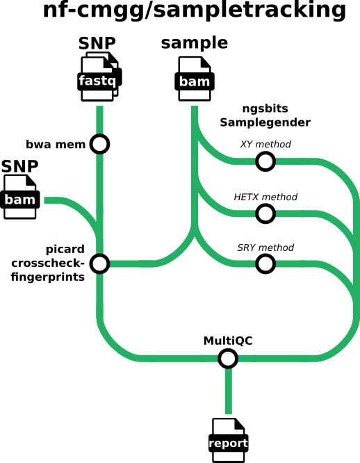

#  

[](https://github.com/nf-cmgg/sampletracking/actions/workflows/ci.yml)
[](https://github.com/nf-cmgg/sampletracking/actions/workflows/linting.yml)[](https://doi.org/10.5281/zenodo.XXXXXXX)
[](https://www.nf-test.com)

[](https://www.nextflow.io/)
[](https://docs.conda.io/en/latest/)
[](https://www.docker.com/)
[](https://sylabs.io/docs/)
[](https://tower.nf/launch?pipeline=https://github.com/nf-cmgg/sampletracking)

## Introduction

**nf-cmgg/sampletracking** is a bioinformatics pipeline that performs sampletracking on sequencing samples. The pipeline does this by crosschecking SNP fingerprints and by checking if the expected sex matches the real sex of the sample.



## Usage

> [!NOTE]
> If you are new to Nextflow and nf-core, please refer to [this page](https://nf-co.re/docs/usage/installation) on how to set-up Nextflow. Make sure to [test your setup](https://nf-co.re/docs/usage/introduction#how-to-run-a-pipeline) with `-profile test` before running the workflow on actual data.

First, prepare a samplesheet with your input data that looks as follows:

`samplesheet.csv`:

```csv
sample,pool,sex,sample_bam,sample_bam_index,snp_bam,snp_bam_index
SAMPLE1,POOL1,F,SAMPLE1.bam,SAMPLE1.bam.bai,SAMPLE1_snp.cram,SAMPLE2_snp.cram.crai
```

Each row represents a sample annotated with the pool it was sequenced in and the expected sex of this sample. It also needs a BAM/CRAM file with the sample data and (optionally) a FASTQ/BAM/CRAM file with SNP tracking data for the sample. Crosschecking fingerprints will be skipped when no SNP tracking data is provided.

Now, you can run the pipeline using:

```bash
nextflow run nf-cmgg/sampletracking \
   -profile <docker/singularity/.../institute> \
   --input samplesheet.csv \
   --outdir <OUTDIR>
```

> [!WARNING]
> Please provide pipeline parameters via the CLI or Nextflow `-params-file` option. Custom config files including those provided by the `-c` Nextflow option can be used to provide any configuration _**except for parameters**_;
> see [docs](https://nf-co.re/usage/configuration#custom-configuration-files).

## Credits

nf-cmgg/sampletracking was originally written by [@matthdsm](https://github.com/matthdsm).

We thank the following people for their extensive assistance in the development of this pipeline:

- [@nvnieuwk](https://github.com/nvnieuwk)

## Contributions and Support

If you would like to contribute to this pipeline, please see the [contributing guidelines](.github/CONTRIBUTING.md).

## Citations

An extensive list of references for the tools used by the pipeline can be found in the [`CITATIONS.md`](CITATIONS.md) file.

This pipeline uses code and infrastructure developed and maintained by the [nf-core](https://nf-co.re) community, reused here under the [MIT license](https://github.com/nf-core/tools/blob/master/LICENSE).

> **The nf-core framework for community-curated bioinformatics pipelines.**
>
> Philip Ewels, Alexander Peltzer, Sven Fillinger, Harshil Patel, Johannes Alneberg, Andreas Wilm, Maxime Ulysse Garcia, Paolo Di Tommaso & Sven Nahnsen.
>
> _Nat Biotechnol._ 2020 Feb 13. doi: [10.1038/s41587-020-0439-x](https://dx.doi.org/10.1038/s41587-020-0439-x).
